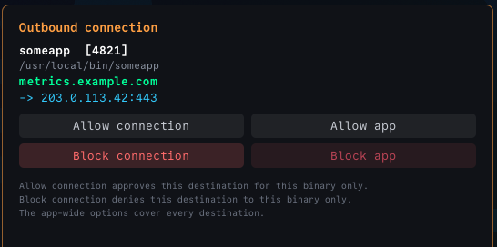
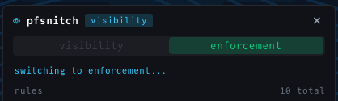
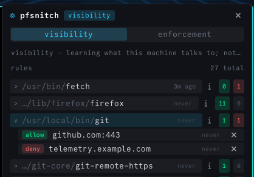
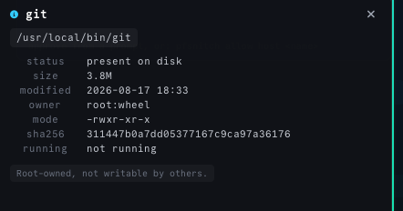

# pfsnitch

Per-application outbound firewall for FreeBSD. Every outbound connection is
intercepted **before it leaves**, attributed to the binary that made it, and
allowed, blocked, or asked about.

Little Snitch's model, built on `pf(4)` divert sockets and `libprocstat`.



The prompt shows what actually matters: which binary, which PID, the hostname it
asked for, and the address that name resolved to. The connection is held — not
buffered — while you decide; TCP's own SYN retransmission carries it, so
answering within ~60s lets the connection succeed normally.

## Two modes



| mode | behaviour |
|---|---|
| **visibility** | Watch and learn. Every packet is reinjected; new destinations are *recorded* as allow rules. No prompts. |
| **enforcement** | Unapproved connections are dropped, and you are prompted for anything new. |

Run visibility for a while, review what it learned, delete what you did not
want, then switch. The mode lives in the policy file, so switching takes effect
in under a second with **no restart** — there is never a window where the divert
socket is down and traffic passes unwatched.

```sh
pfsnitch mode enforcement
```

## Rules are per-binary



Rules are grouped by the binary they belong to, shown as a full path with the
directory dimmed - `/tmp/git` and `/usr/local/bin/git` are different programs
and must not look alike. The **i** button opens the details of the binary a rule
points at:



A standing permission is attached to a path, so the questions that matter are
whether that path still exists, whether it has changed since you approved it,
and whether anyone but root can replace it. A missing binary, a setuid bit, or
group- or world-write permission is called out in red rather than left to be
inferred from a mode string.

Approving `github.com` for `git` does not open it for everything else on the
machine. Blocking one destination leaves the app otherwise working — an app that
phones a metrics endpoint loses the metrics endpoint, not the network.

| kind | matches |
|---|---|
| `allow-host-from` / `deny-host-from` | a hostname, **for one binary**, optionally one port |
| `allow-dest-from` / `deny-dest-from` | one address, **for one binary**, optionally one port |
| `allow-app` / `deny-app` | one binary, every destination |
| `allow-host` / `deny-host` / `allow-dest` / `deny-dest` | any binary — for real infrastructure (a resolver, a gateway) |
| `app-id` | pins the binary's sha256 at the moment it was approved |

Hostname rules are preferred over addresses because they survive round-robin
DNS: one rule covers every address a site answers on, instead of re-prompting
for each rotating CDN address.

A scoped deny is the most specific rule there is, so it beats every broader
allow — including `allow-app` for that same binary. Otherwise approving a host
for one program would silently re-open it for one you had blocked.

Rules carry an optional port, and an approval covers the port it was asked
about - approving a browser's HTTPS access should not also hand it SSH. A rule
without a port still means any port, so older policy files keep their meaning.

```sh
pfsnitch allow host github.com:443 --from /usr/local/bin/git
```

## A rule is pinned to the binary, not just its path

Replace the file behind an approved path and the replacement would inherit every
rule the original earned. So an approval records the binary's sha256, and if it
later differs its rules are ignored and the connection falls back to asking -
with the prompt saying so in red.

FreeBSD binaries are generally unsigned, so a content hash stands in for the code
signature Little Snitch uses.

## Two ways to name the process, one of them in the kernel

Attribution — which binary owns this connection — has two backends, switchable
at runtime like `mode`:

```sh
pfsnitch attribution procstat    # scan the process table (default, no moving parts)
pfsnitch attribution kernel      # ask the optional mac_pfsnitch.ko module
```

The default reconstructs identity backwards from the packet, by scanning every
process's file table — which costs milliseconds and races a process that
connects and exits. The kernel module records identity **forwards**, at
`socket(2)` time in the creating process's own context: exact, race-free, one
ioctl to ask, and it still names a process that quit right after connecting.
Sockets the module never saw (started before it loaded) silently fall back to
the scan, and the log says which backend answered each flow.

Verdicts, policy and packet handling stay in the daemon either way — the module
attributes, it never decides. Build it from `kmod/`; details and caveats in
[docs/KERNEL.md](docs/KERNEL.md).

## Blocked means refused, not hung

A settled deny synthesises a TCP reset, so the application gets
`Connection refused` immediately rather than waiting out a 75 second timeout - a
hang reads as a broken network, not as a decision.

A connection held while a prompt is open is still dropped silently, because
TCP's own retransmission is what carries it until you answer.

## Managing it

```sh
pfsnitch apps                    # rules grouped by application
                                 # with when each was last used
pfsnitch rules                   # flat list
pfsnitch status                  # daemon, mode, counts

pfsnitch allow host github.com --from /usr/local/bin/git
pfsnitch deny  host metrics.example.com --from /usr/local/bin/someapp
pfsnitch rm    deny-host-from metrics.example.com /usr/local/bin/someapp
```

Every rule also records when it was last used, so a rule list can be reviewed
for things left over from months ago rather than only read.

The policy file is plain text, keeps its comments, and is **re-read within a
second of any change** — by the CLI, an editor, or a script. Nothing needs to
signal the daemon.

## The desktop widget is optional


The bundled eww panel is one frontend, not a requirement. Nothing in the daemon
knows it exists. Every command above takes `--json`, and the prompt is just a
program with a fixed contract:

```
argv:   EXE PID COMMAND DST DPORT [HOSTNAME]
stdout: one word — allow-conn | allow-app | block-conn | block-app | timeout
```

Point `pfsnitch_prompt` at any executable honouring that. Four backends ship:
`eww`, `tty` (console/headless), `file` (publishes JSON for any UI to answer),
and `deny` (unattended). See [docs/FRONTENDS.md](docs/FRONTENDS.md).

## What it costs

Every packet of every connection goes through userspace, in both directions -
not just the connection setup. Measured on a 9 MB download over a ~35 Mbit/s
link: 34-35 Mbit/s without pfsnitch, 27-31 Mbit/s with it, and 10,110
diversions for the transfer.

That is roughly 15 µs of CPU per packet for TCP, so a single core tops out
somewhere near 800 Mbit/s. On a laptop the cost is real but small; on a fast
link or a server it will limit throughput.

UDP costs more, because every datagram needs a verdict rather than just a
reinjection. Verdicts are cached per flow - without that, one video stream pegged
a core and the daemon dropped 99% of the traffic it was supposed to be judging.
With it, a streaming rate costs about 0.5% CPU.

See [docs/SAFETY.md](docs/SAFETY.md#what-this-costs) for the measurements, and
for why the obvious fix to the TCP cost does not work.

## Nothing escapes before the daemon is up

`pf.conf` blocks outbound and relies on the `pfsnitch` anchor to re-open it. At
boot the anchor has never been loaded, so it is empty and **no outbound traffic
is permitted at all** until pfsnitch is actually running.

Inbound SSH and DHCP renewal are passed explicitly, so a machine whose daemon
fails to start is still reachable to fix rather than stranded.

See [docs/SAFETY.md](docs/SAFETY.md) for the failure modes, including what the
watchdog does when a running daemon dies.

## How it works

pf hands the packet to userspace and waits — `pf.conf` diverts outbound TCP SYNs
and DNS to a divert socket, and the daemon decides:

```
outbound SYN ──▶ pf anchor ──▶ divert socket ──▶ pfsnitch
                                                    │
                          libprocstat: 4-tuple ─────┤ which binary?
                          DNS cache:    address ────┤ which hostname?
                          policy:       decide  ────┤
                                                    ▼
                                        reinject or drop
```

Policy is keyed on the **executable path**, never the process name — a name is
trivially spoofable and the kernel truncates it to 19 characters anyway.

Hostnames come from snooping plaintext DNS replies. DNS-over-HTTPS is invisible
to this, and such connections appear as bare addresses.

Outbound UDP is diverted too, not just TCP - otherwise QUIC/HTTP3 would bypass
the whole tool. UDP costs more than TCP does (every packet is diverted, and a
dropped datagram is not retransmitted); see [docs/SAFETY.md](docs/SAFETY.md).

## Install

FreeBSD, `pf` enabled. `libc` is the only build dependency — deliberately, for a
firewall.

```sh
cargo build --release
doas ./install.sh
```

The installer stops short of touching `/etc/pf.conf` or starting anything: this
tool sits in the packet path, and that last step should be a decision you make
while looking at the machine. It prints the three remaining commands.

Start in `visibility` and watch what it learns before you enforce anything.

If it ever locks you out, `pfsnitch-panic` is in `PATH`, takes no arguments, and
disables pf outright.

## Layout

```
src/            the daemon and CLI
rc.d/           service script
libexec/        prompt backends and the watchdog
bin/            pfsnitch-answer, pfsnitch-panic
etc/            anchor rules, and samples for pf.conf and policy.conf
contrib/eww/    the desktop widget - one frontend, not a requirement
docs/           the integration contract and the safety model
```

`src/procstat_sys.rs` is checked in rather than generated at build time, which
is what keeps `libc` the only dependency. To regenerate it after a libprocstat
change:

```sh
bindgen src/wrapper.h -o src/procstat_sys.rs \
  --allowlist-function 'procstat_.*' --allowlist-type '(procstat|filestat|sockstat|kinfo_proc).*'
```

## Docs

- [docs/FRONTENDS.md](docs/FRONTENDS.md) — the integration contract: rules, verdicts, prompts, JSON
- [docs/SAFETY.md](docs/SAFETY.md) — failure modes, fail-open vs fail-closed, boot behaviour, scope

## License

MIT — see [LICENSE](LICENSE).
